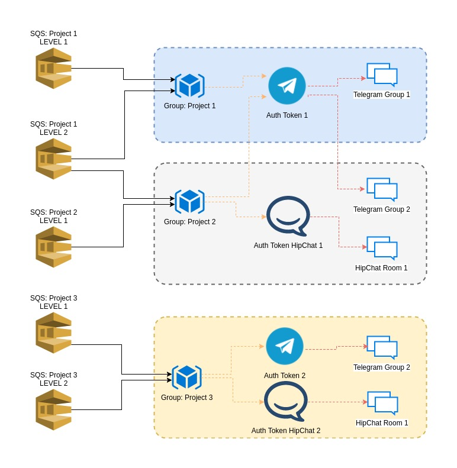

CARBOnic - Trigger SQS messages to Telegram and HipChat
------------
It's a daemon to "listen" messages from SQS and send it to HipChat or Telegram. Really useful to handle alarms from AWS CloudWatch (SNS -> SQS).

You can organice the alarms based in groups and level of the alarms. Depends of the alarm the message will be send to all the channels or just to one.

With simple command like "/catch" the damon will delete the message from the SQS Queue and will comunicate to the Chats (hipchat, telegram..) than you are in carge of the alarm (ACK).

Features
--------

- Create one session to AWS services based in [profiles](http://docs.aws.amazon.com/cli/latest/userguide/cli-chap-getting-started.html#cli-multiple-profiles) and share it with more than one SQS source.
- Use zero or many telegram clients
- Use one connection to telegram and share this connection with more than one group (based in telegram token, yes! you can use more than one telegram token).
- Use zero or many hipchat clients
- Use one pull to hipchat based on RoomID and token and share it with more than one group (also yes, you can use more than one user of telegram)


**Example of connections**



Config file
-----------

```toml
[[Group]]
    Name = "Group 1"

    [Group.Telegram]
    Name = "Telegram client 1"
    Token = "0000000000:ZZZZZZZZZZZZZZZZZZZZZZZZZZZZZZZZZZ"
    Group = -00000000
    MinScore = 10

    [[Group.SQS]]
    Url = "https://sqs.eu-west-1.amazonaws.com/000000000000/PROJECT_1_LEVEL1"
    Region = "eu-west-1"
    Profile = "project1"
    Score = 10

    [[Group.SQS]]
    Url = "https://sqs.eu-west-1.amazonaws.com/000000000000/PROJECT_1_LEVEL2"
    Region = "eu-west-1"
    Profile = "project1"
    Score = 5


[[Group]]
    Name = "Project 2"

    # Same as group 1
    [Group.Telegram]
    Name = "Telegram client 1"
    Token = "0000000000:ZZZZZZZZZZZZZZZZZZZZZZZZZZZZZZZZZZ"
    Group = -00000000
    MinScore = 10

    [Group.HipChat]
    Name = "HipChat client 1"
    Token = "ZZZZZZZZZZZZZZZZZZZZZZZZZZZZZZZZZZZZZZZZZZZ"
    RoomID = "999999"
    MinScore = 5

    [[Group.SQS]]
    Url = "https://sqs.us-west-2.amazonaws.com/000000000000/PROJECT_2_LEVEL1"
    Region = "us-west-2"
    Profile = "project1"
    Score = 10

    # Same as group 1
    [[Group.SQS]]
    Url = "https://sqs.eu-west-1.amazonaws.com/000000000000/PROJECT_1_LEVEL2"
    Region = "eu-west-1"
    Profile = "project1"
    Score = 5


[[Group]]
    Name = "Project 3"

    [Group.Telegram]
    Name = "Telegram client 2"
    Token = "1111111111:YYYYYYYYYYYYYYYYYYYYYYYYYYYYYYYYYY"
    Group = -0000001111
    MinScore = 10

    [Group.HipChat]
    Name = "HipChat client 2"
    Token = "YYYYYYYYYYYYYYYYYYYYYYYYYYYYYYYYYYYYYYYYY"
    RoomID = "0000111"
    MinScore = 5

    [[Group.SQS]]
    Url = "https://sqs.us-west-2.amazonaws.com/000000000000/PROJECT_3_LEVEL1"
    Region = "us-west-2"
    Profile = "project3"
    Score = 10

    [[Group.SQS]]
    Url = "https://sqs.eu-west-2.amazonaws.com/000000000000/PROJECT_3_LEVEL2"
    Region = "eu-west-2"
    Profile = "project3"
    Score = 5

```

Origin of the project
---------------------

In my current job we need to handle alarms from an AWS hosted platform. The alarms are group based, depends of the alarm it should be trigger to part of the team. Also we needed levels for the alarms. Some of them could be handle during laboral hours and the most important should be handle inmediatly, doesn't matter the hour. The sys admins knows what I'm talking about, eh? ;)

We didn't want to install more apps in the phone, with all the complexity that requires in terms of manteniment (Android, iPhone, versions, validations from the stores.., etc..). So the plan was use existing chat platforms. In our case, hipchat is where we speak during laboral hours, and telegram just for urgent messages. 

In future versions could be included slack, zulip, facebook messages..


